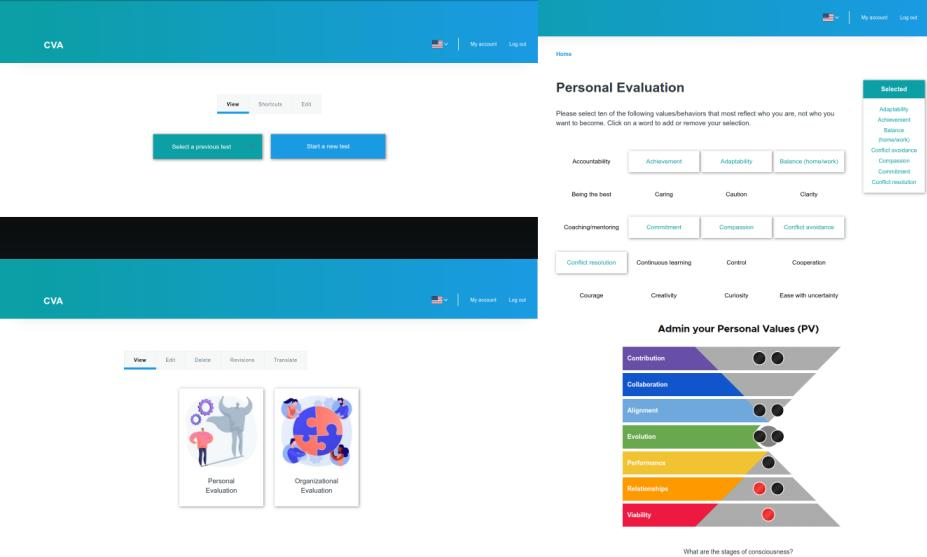

# Value Assessment Project

This value assessment project makes Drupal a value evaluator, making it possible to identify a person's or corporation's level of satisfaction, progress, goals and etc.

## Features

- Implements a third library on Drupal (owl-carousel as e.g.)
- Implements Drupal behaviors
- EventSubscriber (redirect)
- GeoIP location and redirect
- Drupal core/once and drupalSettings
- Create node type programmatically
- Create fields programmatically
- Hook node presave, node insert, form alter, form views exposed form_alter, 
- user register form alter, node access, preprocess html and node load
- How to remove the user register and pass  through menu_local_tasks_alter
- How to remove the content details created through entity_view_alter
- Dependency injection on methods
- Form API, formBuild, validateForm and submitForm
- Change the html dynamic through AjaxResponse, HtmlCommand and RedirectResponse
- Working with img uri, DrupalDateTime, load nodes, url query using fromRoute, getPathAlias, 
- languageManager, get url query through getCurrentRequest query.
- Database manage, create schema, database select and insert
- Drupal routing, role, permissions and links menu
- Drupal Plugin Block and formBuilder getForm inside the Block
- Drupal permissions and roles

## Installation

- db user/pass: admin/admin
- install the password_field module, it's not in my composer, because I had to change its .info to the Drupal 10 version
